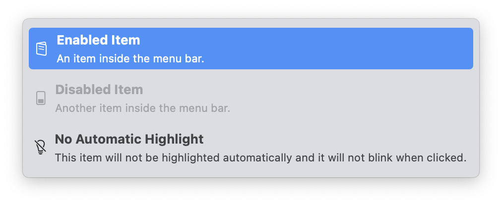

# MenuItemView
MenuItemView is an `NSView` subclass that attempts to replicate the behavior of a `NSMenuItem`. Its main use-case is to be used as wrapper for a custom view that is going to be assigned to a `NSMenuItem` using its `view` property.



By default, when assigning a view to a `NSMenuItem`, the item stops supporting highlighting, selection, and other standard behaviors. You are expected to implement all of those things manually.

This is a tedious process, and it's easy to forget some details. `MenuItemView` is designed to make this process easier by replicating the standard behavior of a `NSMenuItem` and allowing you to focus on the design of your custom view.

This library implements highlighting, manages the apparance of supported subviews automatically, and integrates perfectly with the action-based APIs that are available on `NSMenuItem`. It also attempts to replicate the blinking behavior that is present when a `NSMenuItem` is clicked.

## Installation
MenuItemView is available through [Swift Package Manager](https://swift.org/package-manager).

```swift
.package(url: "https://github.com/MrAsterisco/MenuItemView", from: "<see GitHub releases>")
```

### Latest Release
To find out the latest version, look at the Releases tab of this repository.

## Usage
This view is designed to be used as the `view` property of an `NSMenuItem`. By default, the view is empty: you can design your own content and add it as subview of a `MenuItemView` instance to automatically get menu-like behaviors such as selection, highlighting, and flashing animations when clicked.

```swift
let customView = { /* Build your view */ }()
let menuItemView = MenuItemView()
menuItemView.addSubview(
  customView, 
  layoutAutomatically: true
)

let menuItem = NSMenuItem(
  "Custom Item", 
  action: #selector(customAction), 
  keyEquivalent: ""
)
menuItem.view = menuItemView
// Then add your menu item to a menu somewhere.
```
Your content is added a subview of `MenuItemView` and is automatically laid out to fill the entire bounds of the view. If you want to customize the layout, you can do so by setting the `layoutAutomatically` parameter to `false` (or invoking the `NSView.addSubview` method) and manually laying out your content.

As highlighting means adding a background color to the view, your custom content should react to it by changing its appearance. By default, the `MenuItemView` will automatically change the color of `NSTextField` and `NSImageView` instances (only on macOS 10.14 or higher).

You can turn off this behavior by setting `autoHighlightSubviews` to `false`.

## Advanced Usages
While the easiest use-case is covered by the code above, you can customize multiple parts of the view to ensure it fits exactly your needs.

### Custom Subviews Highlighting
If you have custom subviews that you would like to react to highlighting, you can subclass `MenuItemView` and override `highlightIfNeeded(_:isHighlighted:isEnabled:)`.

```swift
class CustomMenuItemView: MenuItemView {
  override func highlightIfNeeded(_ view: NSView, isHighlighted: Bool, isEnabled: Bool) {
    // Your custom highlighting logic here.
    // Make sure to invoke the function recursively
    // on all the subviews as well, if needed.
  }
}
```

### Click Animation
`NSMenuItem`s react to clicks by flashing the view. This behavior is replicated by default in `MenuItemView`.

The default animation is a `CAAnimationGroup` that quickly changes the highlight view opacity to make it look like it's blinking.

While the animation looks pretty similar to the original, if you wish to change it, there is no need to subclass. You can assign a new `CAAnimation` to the `highlightAnimation` property.

### Custom Layout
If you want to create a more complex layout, just add your subviews as you would do with any `NSView`. If you're using AutoLayout, make sure to align your views to the `layoutMarginsGuide`, so that they are inset correctly.

```swift
let menuItemView = MenuItemView()
let view = NSView()

NSLayoutConstraint.activate([
  view.topAnchor.constraint(equalTo: menuItemView.layoutMarginsGuide.topAnchor),
  view.leadingAnchor.constraint(equalTo: menuItemView.layoutMarginsGuide.leadingAnchor),
  view.bottomAnchor.constraint(equalTo: menuItemView.layoutMarginsGuide.bottomAnchor),
  view.trailingAnchor.constraint(equalTo: menuItemView.layoutMarginsGuide.trailingAnchor)
])
```

## Compatibility
MenuItemView is compatible with **macOS 10.13 or later**.

> Note: while this library also includes a `MenuItem` view to be used in SwiftUI, there is currently no way to make this work. This is due to multiple unexpected behaviors of the `Menu` component in SwiftUI when targeting macOS. This is a known issue and it's been reported to Apple (`FB13622275`).

## Contributions
All contributions to expand the library are welcome. Fork the repo, make the changes you want, and open a Pull Request.

If you make changes to the codebase, I am not enforcing a coding style, but I may ask you to make changes based on how the rest of the library is made.

## Status
This library is under **active development**. Even if most of the APIs are pretty straightforward, **they may change in the future**; but you don't have to worry about that, because releases will follow [Semantic Versioning 2.0.0](https://semver.org/).

## License
MenuItemView is distributed under the MIT license. [See LICENSE](https://github.com/MrAsterisco/MenuItemView/blob/master/LICENSE) for details.